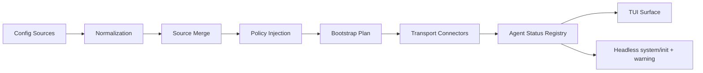

# Phase 16 MCP Runtime Expansion Overview

## 背景

Phase 14 已经把 `session persistence + MCP bootstrap` 接入到 Rust 主链路，Phase 15 又把 `ccc chat --print` 提升为稳定的 `text | json | stream-json` 非交互协议。到 `865ff55` 为止，运行时已经具备一个可工作的最小闭环，但 MCP 仍然停留在 Phase 14 的低复杂度模型：

- `ccc-core::config::McpServerConfig` 仍然只有 `command/args/env` 三元组，等价于纯 `stdio`。
- `ccc-cli::runtime::select_mcp_servers(...)` 只会做 `disabled > enabled > enable_all` 的项目级过滤，不理解 plugin、managed policy、remote transport 或 enterprise-exclusive 语义。
- `ccc-agent` 和 `ccc-mcp` 只承担“给定一组服务器后尝试连接”的最小职责，尚未具备更完整的状态机、策略注入和远程 transport 生命周期。

因此，原始的 “policy/plugin/remote/enterprise MCP” 不能继续作为一个单 phase 推进。它实际包含三组耦合但不等价的问题：

1. 先决定“哪些 server 允许进入候选集并被计划启动”。
2. 再决定“被选中的非 `stdio` server 要怎么连接、重连和汇报状态”。
3. 最后解决“企业/托管配置如何在运行时注入并覆盖前两层决策”。

把这三层揉成一个实现 phase，会导致：

- 配置 schema、policy precedence、transport lifecycle 同时变化，回归面过大。
- 交互 `chat` 与 Phase 15 headless 协议难以维持同一套稳定状态词汇。
- enterprise 规则和 plugin 规则互相穿插，后续实现计划难以拆分。

因此，Phase 16 在 Rust 侧改为一个 **spec pack**：

- `16A`: `policy-aware MCP bootstrap`
- `16B`: `remote MCP transport`
- `16C`: `enterprise / managed MCP`

## 目标

Phase 16 spec pack 的目标不是直接给出一次性实现，而是先把未来 3 个实现 phase 共享的边界写死：

1. 统一 MCP 配置模型，从当前纯 `stdio` 扩展到 tagged union。
2. 统一“source -> policy -> bootstrap -> connect -> status surface”的运行时词汇。
3. 明确哪些职责属于 `ccc-core`、`ccc-cli`、`ccc-agent`、`ccc-mcp`。
4. 把 plugin/policy/managed/transport 的依赖顺序固定下来，避免后续实现阶段反复改口。

## 非目标

本 spec pack 不做以下事情：

- 不直接实现任何代码。
- 不在本轮补写实现计划；实现计划在 spec 确认后分 phase 编写。
- 不承诺本轮更新 `docs/plans/ARCHITECTURE.md`；架构文档的阶段状态更新属于 spec 之后的收口工作。
- 不把 “remote session control plane / general remote REPL / full plugin marketplace system” 也塞进 Phase 16。

## 前置假设

所有 Phase 16 文档都建立在如下前提之上：

1. Phase 14 已完成：
   - `ccc chat` 支持 `last_session_id` 恢复。
   - MCP 已有 Phase 14 的最小 bootstrap。
2. Phase 15 已在特性分支 `codex/phase15-output-protocol-spec` 上完成，基线提交为 `865ff55`：
   - `ccc chat --print` 具备稳定的 headless 输出协议。
   - `system/init` 和 `system/warning` 已成为 MCP 状态对外暴露的稳定入口。

在真正开始实现 Phase 16 之前，需要先把 `865ff55` 合回 `main`。本 spec pack 仅把它当作设计基线，不假装它已经存在于主线。

## 共享术语

### MCP Source Scope

Phase 16 统一把“一个 server 是从哪里来的”建模为 source scope，而不是把来源信息散落在不同字段里。Rust 侧至少需要区分：

| 术语 | 含义 |
|---|---|
| `global` | 来自全局用户配置，例如 `~/.claude/settings.json` |
| `project` | 来自项目配置，例如 `.claude/settings.json` |
| `local` | 来自本地覆盖配置，例如 `.claude/settings.local.json` |
| `builtin-plugin` | 由内建 plugin 提供的 MCP 定义 |
| `plugin` | 由已启用 plugin 提供的 MCP 定义 |
| `managed` | 由 managed settings 注入的 policy 或 provider 元数据 |
| `enterprise` | 由 enterprise-exclusive MCP 配置注入的 server 集 |
| `dynamic` | 运行期临时注入的 server，预留给后续控制面 |
| `claudeai` | 由 `claude.ai` 或代理来源注入的 MCP 定义 |

其中：

- `16A` 实际使用 `global/project/local/builtin-plugin/plugin`，并为其他 scope 预留 type。
- `16C` 负责把 `managed/enterprise` 注入到 `16A` 之前。
- `16B` 消费的是已经 resolved 的 plan，不重新做 source merge。

### Transport Kind

Phase 16 统一 MCP transport 的公共词汇：

- `stdio`
- `sse`
- `http`
- `ws`
- `sdk`
- `claudeai-proxy`

Rust 侧的 `McpServerConfig` 从此必须是 tagged union。是否支持连接由具体 phase 决定：

- `16A` 只需要能解析并把 transport 写进 bootstrap plan。
- `16B` 才真正定义如何连接非 `stdio` transport。

### Policy Source

这里的 policy source 指“是谁定义了约束”，而不是“server 从哪儿来”。至少包括：

- 用户与项目设置合并结果
- managed settings
- enterprise-exclusive MCP 配置
- plugin-only policy
- marketplace / channel policy

### Bootstrap Lifecycle

Phase 16 统一 MCP 启动生命周期为 7 个阶段：

1. `discover`
2. `normalize`
3. `merge`
4. `apply-policy`
5. `plan`
6. `connect`
7. `surface-status`

三个子 spec 对应如下：

- `16A` 覆盖 `discover -> normalize -> merge -> apply-policy -> plan`
- `16B` 覆盖 `connect -> surface-status`
- `16C` 在 `discover` 之前提供 enterprise / managed 注入

### Server Status Vocabulary

对外暴露的 server status 词汇必须与 Phase 15 headless 协议对齐，保持简洁且稳定：

- `pending`
- `connected`
- `failed`
- `needs-auth`
- `disabled`

内部 planning reason 可以更细，例如：

- `blocked-by-policy`
- `disabled-by-project`
- `default-disabled-builtin`
- `suppressed-duplicate`

但这些更细的原因不直接扩充对外状态枚举，而是通过 warning / reason 字段暴露。这样可以避免 TUI、headless JSON、未来 control plane 各自维护一套不兼容状态词汇。

## 共享运行时模型

关键约束：

1. 所有交互与非交互入口都必须消费同一份 `McpBootstrapPlan`。
2. `ccc-cli` 是 source merge 与 policy 应用的唯一装配层，不允许 TUI、headless、Agent 各自重算一遍。
3. `ccc-agent` 只消费 resolved plan 与连接事件，不重新解释 allowlist、denylist、plugin-only 等 policy。
4. `ccc-mcp` 只负责 transport adapter 与连接协议，不持有全局 policy 概念。

## 共享 Rust 抽象方向

### `ccc-core`

只承载 schema、公共 enum 和跨 crate 数据结构，不承载运行时决策：

- `McpTransportKind`
- `McpSourceScope`
- `McpServerConfig`
- `ResolvedMcpServer`
- `McpPolicyDecision`
- `McpBootstrapPlan`
- `McpConnectionStatus`

### `ccc-cli`

负责“从配置到 plan”的装配逻辑：

- 读取全局 / 项目 / 本地配置
- 收集 builtin / plugin / managed / enterprise 来源
- 应用 precedence 与 policy
- 产出统一 `McpBootstrapPlan`

### `ccc-agent`

负责“plan 到运行期状态”的编排逻辑：

- 接收 `McpBootstrapPlan`
- 创建连接注册表
- 记录 per-server 状态迁移
- 把状态暴露给 TUI 和 headless 输出层

### `ccc-mcp`

负责 transport adapter：

- `stdio`
- `sse`
- `http`
- `ws`
- `sdk`
- `claudeai-proxy`

该 crate 不应直接读取用户配置或 managed settings，也不应自己决定一台 server 是否被 policy 允许启动。

## 子 phase 边界与顺序

### `16A`: Policy-Aware MCP Bootstrap

职责：

- 统一 MCP config union
- 统一 source graph
- 统一 precedence / gating / bootstrap plan
- 统一 interactive / headless 的 planning 输出

不做：

- 非 `stdio` transport 的真实连接
- remote managed settings 拉取
- enterprise-exclusive 文件覆盖

### `16C`: Enterprise / Managed MCP

职责：

- managed settings 文件层
- remote managed settings cache / eligibility / refresh
- enterprise-exclusive MCP 配置注入
- plugin marketplace / channel 来源限制对 MCP bootstrap 的影响

不做：

- transport lifecycle
- general remote session UI

### `16B`: Remote MCP Transport

职责：

- 非 `stdio` transport 连接器
- 统一连接状态机
- reconnect / needs-auth / disabled / failed 语义
- TUI / headless 状态对接点

不做：

- org policy
- managed settings 拉取
- plugin source 策略判定

### 推荐顺序

推荐顺序固定为：

1. `16A`
2. `16C`
3. `16B`

原因：

- 没有 `16A`，`16C` 无法知道应该把 managed/enterprise 数据注入到什么结构里。
- `16B` 依赖 `16A` 产出的 transport-tagged bootstrap plan，否则 transport 层没有统一输入。
- `16C` 先于 `16B`，可以避免 transport 层先做一遍不带 enterprise 规则的连接逻辑，然后再返工。

## 跨 spec 的验收标准

四份文档共同满足以下条件时，Phase 16 spec pack 才算完成：

1. 每份文档都明确列出 `Goals / Non-goals`。
2. 每份文档都定义至少一张 precedence 表或生命周期表。
3. 每份文档都明确 failure mode 与降级路径。
4. 每份文档都带可直接转为实现计划的测试矩阵。
5. 三个子 spec 之间对公共类型的命名、状态词汇、职责边界不能互相冲突。

## 后续实现计划入口

spec pack 完成后，后续工作必须按如下顺序继续，而不是一次性实现整个 Phase 16：

1. 为 `16A` 写实现计划
2. 实现并验证 `16A`
3. 为 `16C` 写实现计划
4. 实现并验证 `16C`
5. 为 `16B` 写实现计划
6. 实现并验证 `16B`

这样做的目的是把“配置/策略层”和“连接/传输层”拆开演进，降低回归面，并保持 Phase 15 headless 协议的稳定性。
