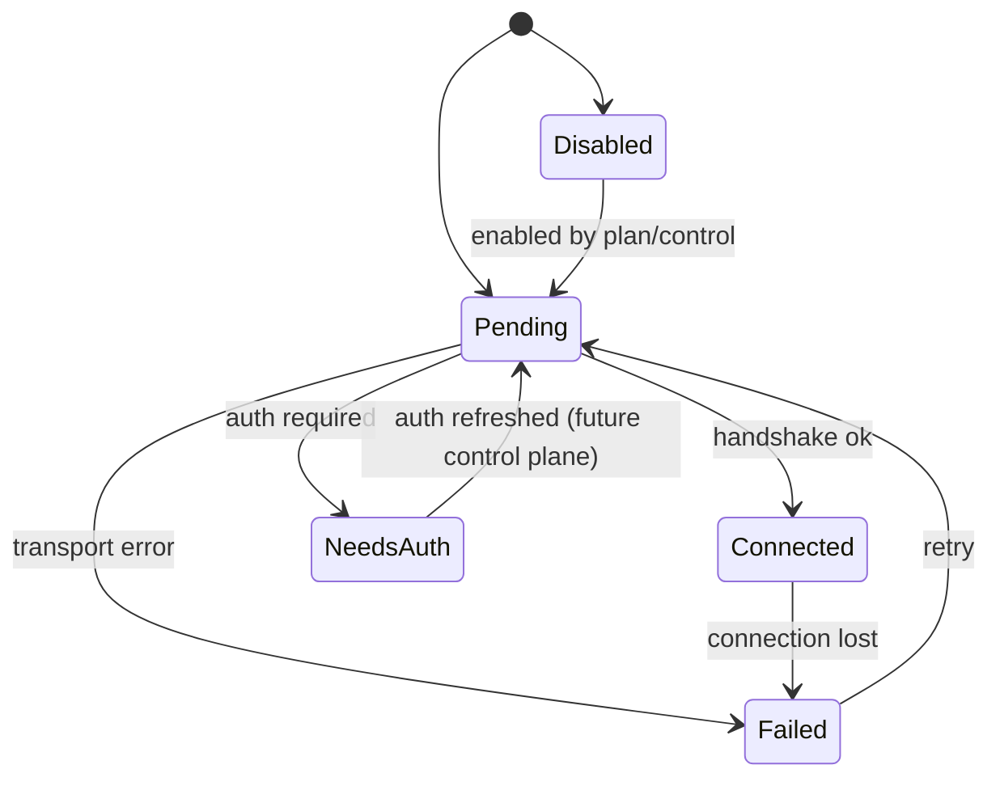

# Phase 16B Remote MCP Transport Design

## 背景

`16A` 解决的是“哪些 server 应该进入启动计划”。`16B` 解决的是另一件独立但紧耦合的事：**当计划里出现非 `stdio` transport 时，Rust 运行时应该如何连接、重连、汇报状态，并把这些状态稳定暴露给 TUI 与 Phase 15 headless 协议。**

截至 `865ff55`：

- Rust 的 `McpServerConfig` 还未正式升级为 transport union。
- `ccc-mcp` 对非 `stdio` transport 没有统一的 connector 抽象。
- `ccc-agent` 还没有 per-server 连接状态注册表。

因此，`16B` 的目标不是做 policy，而是把 **transport lifecycle** 独立成一层，避免 `ccc-cli`、`ccc-agent`、`ccc-mcp` 三个 crate 各自解释一遍远程 MCP 的状态语义。

## Goals

Phase 16B 必须完成以下设计目标：

1. 为以下 transport 定义统一连接层：
   - `sse`
   - `http`
   - `ws`
   - `sdk`
   - `claudeai-proxy`
2. 统一连接状态机：
   - `pending`
   - `connected`
   - `failed`
   - `needs-auth`
   - `disabled`
3. 明确 reconnect、auth placeholder、status reporting 的责任边界。
4. 明确 TUI 与 Phase 15 headless 输出如何消费同一套状态快照。

## Non-goals

Phase 16B 明确不做：

- 不做 org policy、managed allow/deny、plugin-only gating。
- 不做 marketplace 或 channel policy 计算。
- 不实现 remote Claude session 或 general remote REPL。
- 不定义新的 CLI 控制命令；控制动作只预留接口。

## 统一 transport 抽象

### `McpTransportKind`

`16B` 消费 `16A` 产出的 tagged-union `McpServerConfig`，并以 `transport kind` 组织连接逻辑：

```rust
#[derive(Debug, Clone, Copy, PartialEq, Eq, Serialize, Deserialize)]
pub enum McpTransportKind {
    Stdio,
    Sse,
    Http,
    Ws,
    Sdk,
    ClaudeAiProxy,
}
```

transport 与 crate 职责映射固定为：

| transport | 连接实现所在 crate | 备注 |
|---|---|---|
| `stdio` | `ccc-mcp` | 本地进程 + stdio JSON-RPC |
| `sse` | `ccc-mcp` | 远程 SSE stream |
| `http` | `ccc-mcp` | HTTP 请求/响应 transport |
| `ws` | `ccc-mcp` | WebSocket transport |
| `sdk` | `ccc-mcp` 适配层 | 实际执行可回调宿主 SDK |
| `claudeai-proxy` | `ccc-mcp` | 特殊代理 transport |

`ccc-mcp` 必须只知道“如何连”，不负责决定“该不该连”。

## 统一连接状态机

### `McpConnectionStatus`

Rust 侧统一连接状态：

```rust
#[derive(Debug, Clone, Copy, PartialEq, Eq, Serialize, Deserialize)]
#[serde(rename_all = "kebab-case")]
pub enum McpConnectionStatus {
    Pending,
    Connected,
    Failed,
    NeedsAuth,
    Disabled,
}
```

### `McpConnectionSnapshot`

```rust
#[derive(Debug, Clone, PartialEq, Serialize, Deserialize)]
pub struct McpConnectionSnapshot {
    pub name: String,
    pub transport: McpTransportKind,
    pub status: McpConnectionStatus,
    pub reconnect_attempt: Option<u32>,
    pub max_reconnect_attempts: Option<u32>,
    pub error: Option<String>,
    pub source_scope: McpSourceScope,
}
```

字段约束：

- `error` 只在 `failed` 或 `needs-auth` 时可选出现。
- `reconnect_attempt` 只在自动重连流程中出现。
- `source_scope` 用于 TUI / diagnostics 告诉用户这台 server 来自哪里。

### 状态迁移

状态迁移固定如下：



关键决策：

1. `disabled` 既可以来自 `16A` 的 planning 决策，也可以来自未来 control plane 的显式禁用。
2. `needs-auth` 与 `failed` 必须区分：
   - `needs-auth` 表示 transport 可用，但当前缺凭据或需要用户完成授权。
   - `failed` 表示 transport 或握手过程本身失败。
3. `sdk` transport 也必须落到这套状态机里，而不是作为“特殊免状态分支”绕过去。

## Crate 职责边界

### `ccc-mcp`

`ccc-mcp` 负责：

- transport connector trait
- 每类 transport 的具体连接实现
- 握手与低层重试策略
- 将底层错误映射成 `failed` 或 `needs-auth`

不负责：

- 配置来源合并
- allow/deny policy
- 最终对外 UI / headless 呈现

### `ccc-agent`

`ccc-agent` 负责：

- 持有 `McpConnectionRegistry`
- 消费 `McpBootstrapPlan`
- 触发 connector 启动
- 记录 per-server 状态迁移
- 把 snapshot 转发给 TUI 和 headless 输出层

这层是“运行时状态拥有者”，而不是 transport 实现者。

### `ccc-cli`

`ccc-cli` 负责：

- 将 `16A` / `16C` 产出的 `McpBootstrapPlan` 注入 `ccc-agent`
- 为交互 / 非交互路径提供相同的初始 plan

它不负责观察每次 socket 断开或重连细节。

## Reconnect 与 auth 占位策略

### Reconnect

`16B` 需要统一但保守的 reconnect 语义：

1. `stdio` 默认不自动重连，由上层重新 bootstrap。
2. `sse/http/ws/claudeai-proxy` 允许有限次数的自动重连。
3. `sdk` transport 不在 `16B` 内定义自动重连，由宿主 runtime 决定。

统一规则：

- 重连次数与 backoff 配置由 `ccc-agent` 的 registry 持有，`ccc-mcp` 只执行单次连接尝试。
- 超过最大重连次数后状态固定为 `failed`。

### Needs-auth

当 transport 因授权前置条件不足而无法继续时，必须进入 `needs-auth`，而不是直接归类为 `failed`。典型场景：

- 远程 MCP server 需要 OAuth token，但本地尚未登录
- `claudeai-proxy` 缺少会话授权
- 某些 `http` / `sse` transport 返回明确的身份验证需求

`16B` 只定义状态与占位动作，不定义真正的授权 UX。也就是说：

- `needs-auth` 是一个稳定状态
- “如何完成认证” 留给后续 control plane 或 enterprise/auth phase

## 与 headless / TUI 的对接

### TUI

TUI 必须消费 `ccc-agent` 发出的 live snapshot：

- 初始化时显示全部 planned server 及其初始状态
- 状态变化时增量更新
- 对 `failed` / `needs-auth` 展示 error 或 hint

### Phase 15 headless 协议

为了不破坏 Phase 15 已稳定的输出协议，`16B` 对 headless 的契约固定为：

1. `system/init.mcp_servers` 使用每台 server 的初始 snapshot。
2. 若连接在 init 之后失败：
   - 不引入新的稳定 stdout 事件类型
   - 通过 `system/warning` 与最终 `result.warnings` 暴露
3. 若 future phase 需要 live MCP status 流，再新增专门协议，不在 `16B` 偷偷扩充现有事件集合。

这个约束的目的，是让 Phase 15 的 `stream-json` 保持向后兼容，避免 transport 实现落地时顺手破坏既有协议。

## 预留给后续控制面的动作

`16B` 只预留接口，不开放 CLI：

```rust
#[derive(Debug, Clone, PartialEq, Eq)]
pub enum McpControlAction {
    Reconnect,
    Enable,
    Disable,
    RefreshAuth,
    ReplacePlan,
}
```

这些动作的真实入口可能来自：

- 后续 CLI 子命令
- TUI 内部操作
- SDK / print mode control plane

但 `16B` 本身不决定它们如何暴露给用户。

## Failure modes 与降级行为

| 场景 | 行为 |
|---|---|
| 远程 transport URL 非法 | 启动前标记 `failed`，并附错误信息 |
| 握手失败 | 状态转为 `failed`，进入有限重试 |
| 明确返回需要认证 | 状态转为 `needs-auth`，不继续盲目重试 |
| 连接已建立后中断 | `connected -> failed`，再按策略进入 `pending` 重连 |
| `sdk` transport 当前宿主不可用 | 标记 `failed`，不阻断其它 server |
| `claudeai-proxy` 缺少会话上下文 | 标记 `needs-auth` 或 `failed`，由 adapter 判断 |
| 某个 server 持续失败 | 不阻断其他 server，不阻断主 chat 流程 |

只有以下情况应直接失败整个 chat 启动：

- `ccc-agent` 无法建立连接注册表
- `McpBootstrapPlan` 本身结构无效

单个 server 的 transport 失败不能拖垮整个 CLI 会话。

## 测试矩阵

### Config / parsing

- `sse/http/ws/sdk/claudeai-proxy` transport kind 能正确解析
- 每类 transport 能生成正确 connector

### Lifecycle

- `pending -> connected`
- `pending -> needs-auth`
- `pending -> failed`
- `connected -> failed -> pending` 的重连路径
- `disabled` 不会被误启动

### Status surface

- TUI 能收到并显示初始 snapshot 与后续更新
- headless `system/init` 能携带初始状态
- runtime 失败能被转换成 `system/warning` 与 `result.warnings`

### Reconnect / auth

- 可重试错误在次数耗尽前进入 `pending`
- 不可恢复的认证错误进入 `needs-auth`，而不是重试风暴
- 超过最大重连次数后稳定停在 `failed`

## 结果

Phase 16B 完成后，Rust MCP 运行时会第一次具备一个独立的远程 transport 层：

- `16A` 决定“选谁”
- `16B` 决定“怎么连”
- `ccc-agent` 持有状态
- `ccc-mcp` 提供连接器

这样后续无论是 enterprise 规则、control plane 还是 richer headless protocol，都不需要再把 transport 特例硬塞回 `ccc-cli` 的配置装配逻辑里。
